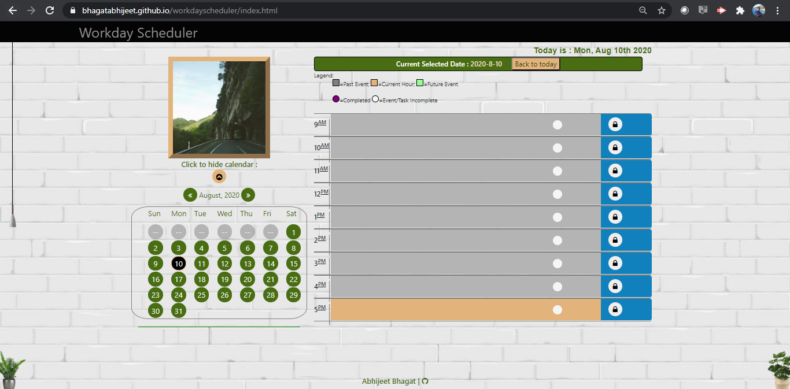

# workdayscheduler
workdayscheduler is a simple calendar application that allows the user to save events for each hour of the day.

# Description
workdayscheduler is a simple calendar application that allows the user to save events for each hour of the day.

# Screenshot & Demo

# Author and Deployment Details

| 1 | GitHub Repo  | https://github.com/bhagatabhijeet/workdayscheduler |
| ------------- | ------------- | ------------- |

| 2 | Git Hub Pages  | https://bhagatabhijeet.github.io/workdayscheduler/index.html |
| ------------- | ------------- | ------------- |

| 3 | Abhijeet Bhagat   | https://github.com/bhagatabhijeet |
| ------------- | ------------- | ------------- |

## Third party API Libraries

* jQuery 3.5.1
* Bootstrap 4.5
* Font Awesome 4.7
* moment.js (heavily used)

