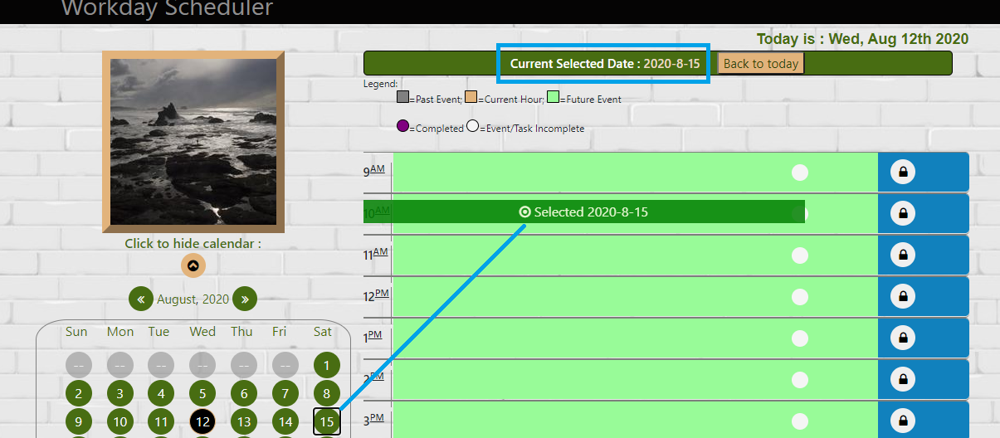
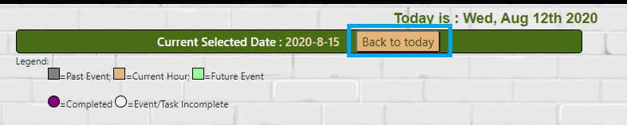
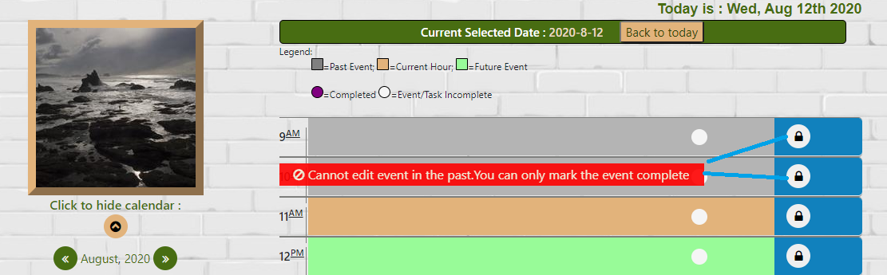
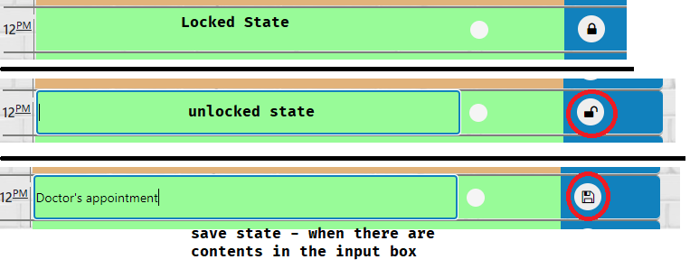
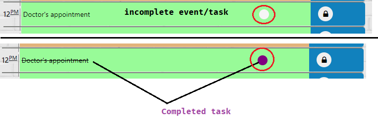
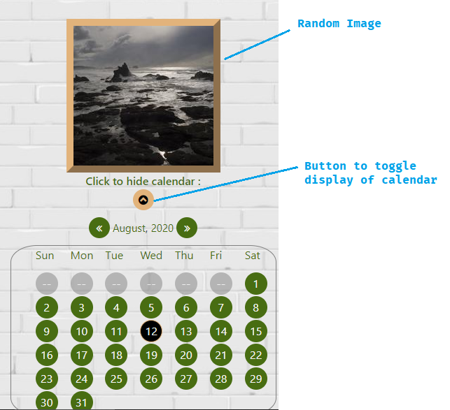

# workdayscheduler
workdayscheduler is a simple calendar application that allows the user to save events for each hour of the day.

# Description
workdayscheduler is a simple calendar application that allows the user to save events for each hour of the day.

# Screenshot & Demo

# Author and Deployment Details

| 1 | GitHub Repo  | https://github.com/bhagatabhijeet/workdayscheduler |
| ------------- | ------------- | ------------- |

| 2 | Git Hub Pages  | https://bhagatabhijeet.github.io/workdayscheduler/index.html |
| ------------- | ------------- | ------------- |

| 3 | Abhijeet Bhagat   | https://github.com/bhagatabhijeet |
| ------------- | ------------- | ------------- |

## Third party API Libraries

* jQuery 3.5.1
* Bootstrap 4.5
* Font Awesome 4.7
* moment.js (heavily used)

# User Guide / Help
1. Once you select a date on calendar that day becomes the "selected day". Selected date message is shown on the screen. 

2. If the current selected date is in future or past user can come back to current date by clicking "Back to today" button.

3. The legend shows how the current hour,past and future timeslots will be colored.

4. You **cannot** edit item in the past, but you can always mark the item as **"completed"**
Note: - you can mark the item completed **only if it exists.** If you try to mark item completed which never existed the checkbox will not change to 'completed'. This is inbuilt functionality which keeps the data integrity and disallows user from wrongly manipulating the past events.

5. If you try to edit the item in past a red colored message box is shown. By definition any hour which is *not current* and *not in future* is "past"

6. The "lock/unlock/save" button has 3 states - locked, unlocked and saved.

7. Each item (item which is already available in storage) can be in 2 states - isComplete === false and isComplete === true. The completed items text will be striked through to visually show the completed item. In addition the completed item checkbox is 'purple' in color which is another visual clue to the user.

8. Random image shown to the user, everytime the page refreshes. User can also show hide the calendar

